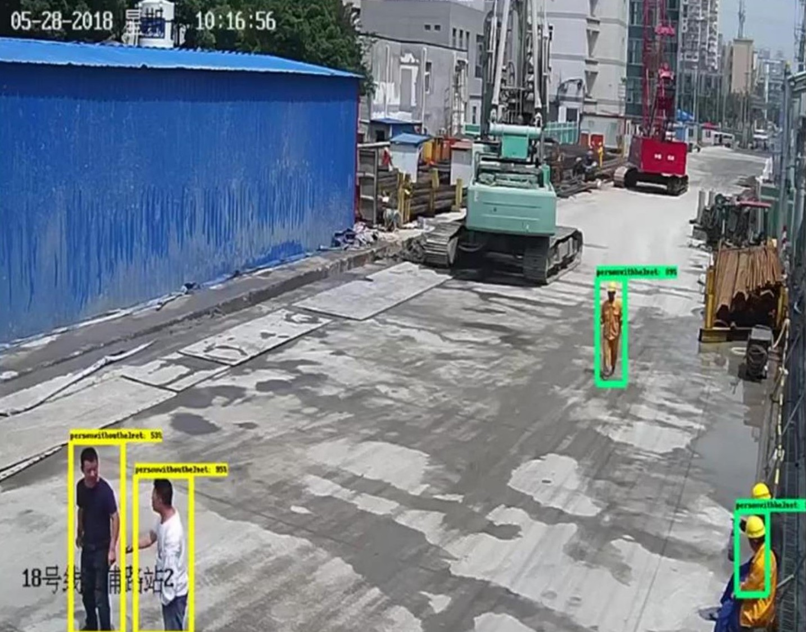

# 园区安全帽识别项目
注：本项目为商用项目的前期探索版本，正式商用项目的代码未放出，该项目仅作流程参考使用。   
**Author:** birdguan  
**Email:** birdguan@seu.edu.cn; xuchen_guan@163.com

## 系统配置简单说明
-工控机：研华610 4U、研华某型号主板、16G、256G/1T、某硕1060 6G  
-UPS：某品牌（应对工地现场极端工况下可能出现的突然掉电，给予保存数据、安全关机的时间）

## 参数说明
### 用户参数
```python
@CAMERA_NUM:网络摄像头的数目
@camera_addressi:各个网络摄像头的RTSP取流地址
    --遵循：rtsp://用户名:密码@IP地址:RTSP端口（默认554）/流格式（一般Streaming）/Channels/通道号（一般主通道101）
@URL: 上传地址
@USERNAME: 上传所需用户名字段
@PASSWORD: 上传所需密码字段
@STATIONCODE: 地铁站站点编码
@STATIONNAME: 地体站站点名称
@INERAL: 检测间隔时间，以秒为单位
@PERSON_FILEPATH: 存放人图像的文件路劲
@PERSON_WITH_OUT_HELMET_PATH: 未佩戴安全帽的工人所在场景的照片存放路径
```
### 系统参数
```python
PATH_TO_PERSON_CKPT = 'personDetect/frozen_inference_graph.pb'
PATH_TO_PERSON_LABELS = 'personDetect/personDetect.pbtxt'
PATH_TO_HELMET_CKPT = 'helmetDetect/graph/20190530/frozen_inference_graph.pb'
PATH_TO_HELMET_LABELS = 'helmetDetect/data/helmetDetect.pbtxt'
PERSON_SCORE_THRESHOLD = 0.75
HELMET_SCORE_THRESHOLD = 0.4
NUM_HELMET_CLASSES = 2
NUM_PERSON_CLASSES = 1
width = 1280
height = 720
height_show = 720 // 2
width_show = 1280 // 2
```
## 效果

